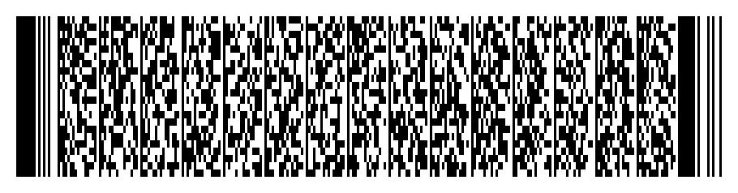

# California DL/ID PDF417 Barcode Generator (AAMVA v09)

A Windows desktop application that generates the **PDF417 / AAMVA barcode** used
on the back of a **California driver license / ID card** from the data you type
into its fields. It strictly follows the AAMVA DL/ID Card Design Standard and
the California encoding used for the card design in production **2018 – October
2025** (AAMVA **version 09**, California IIN **636014**).

> ### Intended use
> This tool is for **testing and development of barcode-reading and
> ID‑verification software** (scanner QA, point‑of‑sale age checks, parser
> development, security research). It produces an **AAMVA data payload and its
> PDF417 image only** — it is **not** a government document, contains none of the
> physical security features of a real card, and must **not** be used to produce
> fraudulent identification.



---

## What it does

- Text fields for **every** AAMVA data element (all mandatory elements plus the
  common optional and REAL ID / DHS elements).
- Dropdowns for the enumerated fields (sex, eye/hair colour, name‑truncation,
  compliance type, state, height unit) so you can only enter valid codes.
- **Strict AAMVA encoding**, verified byte‑for‑byte against the standard's own
  worked example.
- **Live PDF417 preview** and export to **PNG** (raster) or **SVG** (vector).
- **Raw payload** and **decoded** views so you can confirm exactly what a scanner
  will read.
- California **`ZC` jurisdiction subfile** support (see note below).
- Input **validation** with clear, field‑specific error messages.

## Standards implemented

| Part | Detail |
|------|--------|
| Header | `@` `LF` `RS` `CR` `ANSI ` + IIN(6) + AAMVA ver(2) + jurisdiction ver(2) + entries(2) — 21 fixed bytes |
| Issuer (IIN) | **636014** (California) |
| AAMVA version | **09** — AAMVA Card Design Standard, 09‑2016 |
| Subfiles | `DL` (always) and California `ZC` (when supplied) |
| Subfile designator | type(2) + offset(4) + length(4); offset from byte 0, length includes the 2‑char type and terminating `CR` |
| Data elements | `ELEMENT_ID(3)` + value, separated by `LF`, subfile ends with `CR` |
| Dates | `MMDDCCYY` (US jurisdictions) |
| Height (DAU) | `NNN in` / `NNN cm`, zero‑padded, 6 bytes (e.g. `068 in`) |
| Postal (DAK) | numeric ZIP padded to 9 digits, fixed 11‑byte field |
| Colours | 3‑letter codes; **California encodes brown as `BRN`** (the AAMVA D‑20 code is `BRO`) for both eye colour (DAY) and hair colour (ZCB) |

The `DL` subfile always contains the **22 mandatory elements** (Table D.3):
`DCA DCB DCD DBA DCS DAC DAD DBD DBB DBC DAY DAU DAG DAI DAJ DAK DAQ DCF DCG
DDE DDF DDG`. Optional elements (Table D.4) are included only when you enter a
value.

### California specifics (deviations from the base AAMVA standard)

Real California cards differ from a generic AAMVA card in two ways this app
reproduces:

- **Brown is `BRN`, not `BRO`.** The AAMVA D‑20 dictionary abbreviates brown as
  `BRO`, but California encodes it as `BRN` for both eye colour (`DAY`) and hair
  colour (`ZCB`). Only brown deviates; other colours use the standard D‑20 code.
- **Hair colour is encoded twice.** California carries hair colour in *both* the
  standard AAMVA `DAZ` element (in the `DL` subfile) *and* as element `ZCB` in
  the jurisdiction‑specific `ZC` subfile. Both use the same California colour
  code.

The California `ZC` subfile layout is:

| Element | Contents |
|---------|----------|
| `ZCA` | *(not present)* |
| `ZCB` | hair colour (California code) |
| `ZCC` | present but blank on issued cards |
| `ZCD` | present but blank on issued cards |

Set the hair colour once in **Physical description**; it populates both `DAZ`
and `ZCB`. The `ZC` subfile is emitted whenever a hair colour is present (with
`ZCC`/`ZCD` written blank). Leave the hair colour empty to omit both `DAZ` and
the `ZC` subfile.

## Requirements

- **Windows 10/11** (also runs on macOS/Linux for development).
- **Python 3.9+** installed from [python.org](https://www.python.org/downloads/)
  with the **“tcl/tk and IDLE”** option checked (this provides Tkinter).

Install the runtime dependencies:

```bat
pip install -r requirements.txt
```

## Running the app

```bat
python run.py
```

or

```bat
python -m ca_dl_barcode
```

Fill in the fields (click **Load sample** to see a complete example), then:

- **Generate / Preview** – validate and render the barcode.
- **Save PNG** / **Save SVG** – export the barcode image.
- **Raw payload** / **Decoded view** – inspect and copy the encoded data.

## Building a standalone Windows `.exe`

You can package the app into a single `.exe` that runs without a Python install.
See **[build/BUILD_WINDOWS.md](build/BUILD_WINDOWS.md)** for the PyInstaller
recipe.

## Verifying correctness

The test suite pins the encoder to the AAMVA standard and proves the generated
image is scannable:

```bat
pip install -r requirements-dev.txt
python -m pytest -q
```

- `tests/test_encoder.py` reproduces AAMVA Annex D.13's example **byte‑for‑byte**
  (header, offsets, lengths, ordering, terminators) and checks California
  formatting and validation.
- `tests/test_barcode_roundtrip.py` encodes → renders a PDF417 image → **decodes
  it back** and confirms the payload is identical (requires the optional
  `pdf417decoder`).

## Project structure

```
AAMVA/
├── run.py                     # launches the GUI
├── requirements.txt           # runtime deps (pdf417gen, Pillow)
├── requirements-dev.txt       # + pytest, pdf417decoder, pyinstaller
├── ca_dl_barcode/
│   ├── constants.py           # control chars, IIN, code lists, defaults
│   ├── formatting.py          # dates, height, postal, weight formatters
│   ├── model.py               # LicenseData + ZCSubfile, element ordering
│   ├── encoder.py             # header + subfile assembly (byte-exact)
│   ├── validation.py          # field validation against AAMVA limits
│   ├── barcode.py             # PDF417 -> PNG / SVG
│   ├── parser.py              # decode a payload back to fields
│   └── gui.py                 # Tkinter application
├── tests/                     # pytest suite (see above)
├── assets/                    # sample barcode PNG/SVG
└── build/BUILD_WINDOWS.md     # PyInstaller instructions
```

## References

- AAMVA DL/ID Card Design Standard — Annex D “PDF417 bar code”
  (D.12.3 Header, D.12.4 Subfile Designator, D.12.5 Data elements, D.13 Example).
- AAMVA D‑20 data dictionary — eye/hair colour codes.
- California Issuer Identification Number: 636014.
